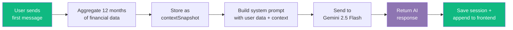

# FinSmart — AI-Powered Personal Finance Dashboard

[](https://react.dev)
[](https://expressjs.com)
[](https://www.mongodb.com)
[](https://tailwindcss.com)
[](https://redux-toolkit.js.org)
[](https://aistudio.google.com)
[](#)

A full-stack personal finance management platform with an AI-powered financial assistant. Track income and expenses, set monthly budgets, visualize spending patterns, and ask natural-language questions about your finances — all backed by secure cookie-based authentication.

> **📌 Project Context:** Built for learning as part of **AlmaBetter's AlmaX Program Assignment**.

---

## Quick Start

```bash
# Clone the repository
git clone https://github.com/mdmunna84880/FinSmart.git
cd FinSmart

# Start the backend (Terminal 1)
cd backend && npm install && npm run dev

# Start the frontend (Terminal 2)
cd frontend && npm install && npm run dev
```

Backend → `http://localhost:8000` &nbsp;|&nbsp; Frontend → `http://localhost:5173`

---

## Table of Contents

- [Features](#features)
- [Architecture](#architecture)
- [Tech Stack](#tech-stack)
- [Project Structure](#project-structure)
- [Prerequisites](#prerequisites)
- [Getting Started](#getting-started)
- [Environment Variables](#environment-variables)
- [API Reference](#api-reference)
- [Authentication](#authentication)
- [AI Chat Assistant](#ai-chat-assistant)
- [Design Decisions](#design-decisions)
- [Build & Deployment](#build--deployment)
- [Author](#author)

---

## Features

### Financial Management
| Feature | Description |
|---------|-------------|
| **Dashboard** | Net savings, income/expenses, 6-month cash flow chart, recent transactions, budget progress |
| **Transactions** | Full CRUD with search, pagination, and dynamic filters (year, month, category, type) |
| **Budgets** | Monthly spending limits with per-category caps, actual-vs-planned summaries |
| **Analytics** | Category spending donut chart, budget-vs-actual progress per category |
| **Profile & Security** | Password change form, budget configuration modal |

### AI Financial Assistant
| Feature | Description |
|---------|-------------|
| **Contextual Answers** | Gemini 2.5 Flash analyzes 12 months of real financial data |
| **Persistent Sessions** | Conversation history saved — pick up where you left off |
| **Optimistic UI** | Messages appear instantly before the server responds |
| **Markdown Rendering** | Bold text, lists, and code blocks rendered in brand styling |
| **Quick Prompts** | 8 predefined questions for first-time users |

### Platform
| Feature | Description |
|---------|-------------|
| **Secure Auth** | JWT via HTTP-only cookies — no localStorage exposure |
| **Responsive Design** | Mobile-first with collapsible sidebar, hamburger menu, overlay drawer |
| **Route Guards** | Protected/public routes with auto-redirect based on auth state |
| **Toast Notifications** | Success/error feedback on every operation |
| **Dual Validation** | React Hook Form + Joi schemas on both client and server |

---

## Architecture

FinSmart is organized into three tiers: a React frontend, an Express backend, and a MongoDB data layer — with Google Gemini integrated as an external AI service.

```
┌──────────────────────────────────────────────────────────────────┐
│  Frontend  —  React 19 + Vite + Redux Toolkit                   │
│  http://localhost:5173                                           │
│                                                                  │
│  Pages        Components       Store          Utils              │
│  ─────        ──────────       ─────          ─────              │
│  Dashboard    Button           authSlice      api.js (Axios)     │
│  Transactions Input           chatSlice      cn.js (clsx)        │
│  Analytics    Modal            txnSlice       chartUtils.js       │
│  Profile      Sidebar          budgetSlice    formatters          │
│  ChatWidget   Navbar           securitySlice  Joi schemas        │
│  Landing      Charts, Tables                    │                │
│                                                                  │
│              All requests go through → api.js (Axios)            │
│              withCredentials: true → cookies sent automatically  │
└──────────────────────────────┬───────────────────────────────────┘
                               │
                    POST / GET / PUT / DELETE
                    Cookie: token=<JWT>
                               │
                               ▼
┌──────────────────────────────────────────────────────────────────┐
│  Backend  —  Express 5 + Mongoose 9                              │
│  http://localhost:8000                                           │
│                                                                  │
│  Request Flow (top to bottom):                                   │
│  ┌────────────────────────────────────────────────────────────┐ │
│  │  1. CORS — origin: CLIENT_URL, credentials: true           │ │
│  │  2. express.json() — parse request body                    │ │
│  │  3. cookieParser() — read HTTP-only JWT cookie             │ │
│  │  4. morgan — log request (dev mode)                        │ │
│  │  5. verifyJWT* — decode token → req.user                   │ │
│  │  6. validateRequest* — Joi schema check                    │ │
│  └────────────────────────────────────────────────────────────┘ │
│                                                                  │
│  * = applied selectively per route                              │
│                                                                  │
│  Code Pattern:                                                   │
│  routes/ → controllers/ → services/ or repositories/ → models/  │
│                                                                  │
│  Example — POST /chat/message:                                   │
│  chatRoutes → chatController.sendMessage                         │
│    → chatRepository.aggregateUserFinancialData(user)             │
│    → chatService.generateGeminiResponse(msg, context, history)   │
│    → save ChatSession → return { sessionId, reply }              │
│                                                                  │
│  Resources (4 modules):                                          │
│  ┌──────────┬─────────────────┬────────────────────────────┐    │
│  │ Module   │ Model           │ Key Endpoints              │    │
│  ├──────────┼─────────────────┼────────────────────────────┤    │
│  │ Users    │ User            │ /users/register            │    │
│  │          │                 │ /users/login               │    │
│  │          │                 │ /users/me                  │    │
│  │          │                 │ /users/change-password      │    │
│  ├──────────┼─────────────────┼────────────────────────────┤    │
│  │ Trans.   │ Transaction     │ /transactions              │    │
│  │          │                 │ /transactions/filters      │    │
│  │          │                 │ /transactions/:id          │    │
│  ├──────────┼─────────────────┼────────────────────────────┤    │
│  │ Budgets  │ Budget          │ /budgets                   │    │
│  │          │                 │ /budgets/summary           │    │
│  ├──────────┼─────────────────┼────────────────────────────┤    │
│  │ Chat     │ ChatSession     │ /chat/message              │    │
│  │          │                 │ /chat/sessions             │    │
│  │          │                 │ /chat/sessions/:id         │    │
│  └──────────┴─────────────────┴────────────────────────────┘    │
│                                                                  │
│                  │                               │               │
└──────────────────┼───────────────────────────────┼───────────────┘
                   ▼                               ▼
┌──────────────────────────┐      ┌──────────────────────────────┐
│  MongoDB                 │      │  Google Gemini 2.5 Flash     │
│  Database: finsmart      │      │                              │
│                          │      │  Called by: chatService.js   │
│  Collections:            │      │                              │
│  ┌────────────────────┐  │      │  Input:                      │
│  │ users              │  │      │  - System prompt + user name │
│  │ transactions       │  │      │  - contextSnapshot (JSON)    │
│  │ budgets            │  │      │  - Conversation history      │
│  │ chatsessions       │  │      │  - User message              │
│  └────────────────────┘  │      │                              │
└──────────────────────────┘      │  Output:                     │
                                  │  - AI response text          │
                                  └──────────────────────────────┘
```

---

### How Data Flows

#### Authentication Flow

```
1. User submits login form (email + password)
       │
2. Frontend dispatches loginUser(email, password)
       │
3. POST /users/login  →  body: { email, password }
       │
4. Backend: find user → compare password (bcrypt)
       │
5. Backend: user.generateAccessToken() → sign JWT with { _id, email }
       │
6. Backend: res.cookie("token", jwt, { httpOnly, secure, sameSite })
       │
7. Frontend receives { user } in response → stores in Redux
       │
8. Browser stores cookie → sent with every subsequent request
       │
9. App mounts → dispatches getUserProfile() → GET /users/me
       │         cookie auto-sent → backend decodes → returns user
       │
10. Redux sets user → protected routes unlocked
```

#### AI Chat Flow

```
1. User types message in ChatInputBar (or clicks quick prompt)
       │
2. Redux dispatches sendMessage({ message, sessionId })
       │
3. Optimistic UI: user message pushed to messages[] immediately
       │
4. POST /chat/message  →  body: { message, sessionId }
       │
5. Backend: if first message in session → aggregateUserFinancialData(user)
       │    Fetches last 12 months of:
       │    - transactions (total income, expense, net savings)
       │    - monthly trends (income/expense grouped by YYYY-MM)
       │    - top expense categories (sorted descending)
       │    - active budgets (last 12 months)
       │    - 20 most recent transactions
       │
6. Backend: stores result as contextSnapshot in ChatSession
       │
7. Backend: generateGeminiResponse(userMessage, contextSnapshot, history)
       │    - Builds system prompt with user name + financial JSON
       │    - Sets up Gemini chat with greeting + conversation history
       │    - Sends user message → receives AI text response
       │
8. Backend: appends user message + AI reply to session.messages[]
       │
9. Frontend: receives { sessionId, title, reply }
       │    - Pushes AI reply to messages[]
       │    - If new session, prepends to sessions[] list
       │    - ChatMessages auto-scrolls to bottom
```

#### Transaction Filter Flow

```
1. User changes a filter dropdown or types in search
       │
2. useTransactionFilters hook updates params (300ms debounce on search)
       │
3. Redux dispatches fetchTransactions(params)
       │
4. GET /transactions?page=1&limit=20&year=2026&category=Food
       │
5. Backend: buildTransactionMatch(userId, filters)
       │    Constructs MongoDB query:
       │    {
       │      userId: ObjectId,
       │      date: { $gte: 2026-01-01, $lt: 2027-01-01 },
       │      category: "Food"
       │    }
       │
6. Backend: find(query).skip().limit() + countDocuments(query) in parallel
       │
7. Frontend: receives { data, pagination } → renders table
       │
8. Simultaneously: fetchAvailableFilters() → GET /transactions/filters
       │    MongoDB $facet aggregation → { years, months, categories, types }
       │    Dropdowns updated to show only options that exist in data
```

---

### Data Model Relationships

```
┌──────────────┐
│    User      │  One user account
│  ──────────  │
│  _id         │
│  name        │
│  email (UQ)  │
│  password    │◄── hashed with bcrypt (10 rounds)
│  timestamps  │
└──────┬───────┘
       │
       │  1 : N
       ├──────────────────┬──────────────────┬──────────────────┐
       ▼                  ▼                  ▼                  ▼
┌──────────────┐  ┌──────────────┐  ┌──────────────┐  ┌──────────────────┐
│ Transaction  │  │   Budget     │  │ ChatSession  │  │                  │
│  ──────────  │  │  ──────────  │  │  ──────────  │  │                  │
│  userId (FK) │  │  userId (FK) │  │  userId (FK) │  │  messages[]      │
│  amount      │  │  year        │  │  title       │  │  ──────────      │
│  type        │  │  month       │  │  messages[]  │  │    role          │
│  category    │  │  monthlyBgt  │  │  contextSnap │  │    content       │
│  date        │  │  savingsTgt  │  │  timestamps  │  │    timestamps    │
│  desc        │  │  catLimits[] │  └──────────────┘  │                  │
│  timestamps  │  │  timestamps  │                     │  contextSnapshot │
└──────────────┘  └──────────────┘                     │  ─────────────── │
                                                       │  (JSON blob)     │
                                                       │  12mo financial  │
                                                       │  summary         │
                                                       └──────────────────┘
```

| Relationship | Type | Detail |
|-------------|------|--------|
| User → Transaction | One-to-Many | `userId` references `User._id`, indexed |
| User → Budget | One-to-Many | `userId` references `User._id`, unique on `(userId, year, month)` |
| User → ChatSession | One-to-Many | `userId` references `User._id`, indexed on `(userId, updatedAt)` |
| ChatSession → messages[] | Embedded | Subdocument array, no separate collection |
| ChatSession → contextSnapshot | Embedded | Mixed-type field, null until first message |
| Budget → categoryLimits[] | Embedded | Subdocument array of `{ category, limit }` |

### Database Indexes

| Collection | Index | Type | Purpose |
|------------|-------|------|---------|
| `users` | `email` | Unique, single-field | Prevents duplicate accounts, speeds login lookup |
| `transactions` | `userId` | Single-field | Ownership scoping on every query |
| `transactions` | `userId + date` | Compound | Date-range queries for a user |
| `transactions` | `userId + category` | Compound | Category-wise aggregation |
| `transactions` | `userId + type` | Compound | Income vs expense filtering |
| `budgets` | `userId + year + month` | Unique compound | Enforces one budget per user per month |
| `chatsessions` | `userId` | Single-field | Ownership scoping |
| `chatsessions` | `userId + updatedAt` | Compound | List sessions sorted by recency |

---

## Tech Stack

### Frontend

| Category | Technology | Version |
|----------|------------|---------|
| Framework | React | 19.2.4 |
| Build Tool | Vite | 8.0.1 |
| Routing | React Router | 7.13.2 |
| State Management | Redux Toolkit + React Redux | 2.8.2 / 9.2.0 |
| Styling | Tailwind CSS | 4.2.2 |
| Charts | Recharts | 3.8.0 |
| Forms | React Hook Form + @hookform/resolvers | 7.61.0 / 5.2.0 |
| Validation | Joi | 17.13.3 |
| HTTP Client | Axios | 1.10.0 |
| Markdown | react-markdown | 10.1.0 |
| Notifications | React Toastify | 11.0.5 |
| Icons | React Icons (Feather) | 5.6.0 |

### Backend

| Category | Technology | Version |
|----------|------------|---------|
| Runtime | Node.js (ES modules) | v18+ |
| Framework | Express | 5.2.1 |
| Database | MongoDB via Mongoose | 9.x |
| Auth | JWT in HTTP-only cookies | jsonwebtoken 9.x |
| Validation | Joi | 18.x |
| Password Hashing | bcryptjs | 3.x (10 salt rounds) |
| AI | Google Gemini (`@google/generative-ai`) | 0.24.x |
| Logging | Morgan | 1.10.x |

---

## Project Structure

```
Week_5_Project/
│
├── 📁 backend/                        Express REST API
│   ├── 📁 src/
│   │   ├── 📁 config/                 Database connection, environment config
│   │   ├── 📁 controllers/            Request handlers (user, transaction, budget, chat)
│   │   ├── 📁 services/               Business logic (query builder, Gemini response generation)
│   │   ├── 📁 repositories/           Data access layer (filter aggregations, financial context)
│   │   ├── 📁 models/                 Mongoose schemas (User, Transaction, Budget, ChatSession)
│   │   ├── 📁 routes/                 Express routers per resource
│   │   ├── 📁 middlewares/            Auth, validation, error handling, no-cache
│   │   ├── 📁 utils/                  Custom error class, Joi validation schemas
│   │   ├── 📄 app.js                  Express application factory
│   │   └── 📄 index.js                Server entry point (DB connect + listen)
│   ├── 📄 package.json
│   └── 📖 README.md                   Backend-specific documentation
│
├── 📁 frontend/                       React Single Page Application
│   ├── 📁 src/
│   │   ├── 📁 store/
│   │   │   └── 📁 slices/             Redux slices (auth, chat, transactions, budget, security)
│   │   ├── 📁 utils/                  Axios instance, class merge helper, formatters, validation
│   │   ├── 📁 components/
│   │   │   ├── 📁 common/             Button, Input, Modal, Loading, Logo, Route guards
│   │   │   └── 📁 layout/             MainLayout, Sidebar, Navbar, nav items
│   │   ├── 📁 pages/
│   │   │   ├── 📁 auth/               Login, Register forms
│   │   │   ├── 📁 landing/            Hero, Features, Security, Footer, PublicNavbar
│   │   │   ├── 📁 dashboard/          Overview cards, cash flow chart, budget progress
│   │   │   ├── 📁 transactions/       CRUD table, filters, pagination, modals
│   │   │   ├── 📁 analytics/          Donut chart, category budget list
│   │   │   ├── 📁 profile/            User info, budget config, password change
│   │   │   ├── 📁 chat-widget/        FAB, chat panel, sessions sidebar, messages, input bar
│   │   │   └── 📁 not-found/          404 error page
│   │   ├── 📄 App.jsx                 Route definitions + auth bootstrap
│   │   ├── 📄 main.jsx                Entry point (Redux Provider + Router)
│   │   └── 📄 index.css               Tailwind config, custom theme, animations
│   ├── 📄 vercel.json                 SPA rewrites + asset caching headers
│   ├── 📄 package.json
│   └── 📖 README.md                   Frontend-specific documentation
│
└── 📋 FinSmart_API.postman_collection.json    Postman collection with all endpoints
```

> Each sub-project (`backend/`, `frontend/`) has its own `README.md` with in-depth documentation.

---

## Prerequisites

| Requirement | Version | Notes |
|-------------|---------|-------|
| **Node.js** | v18+ | [Download](https://nodejs.org/) |
| **npm** | v9+ | Bundled with Node.js |
| **MongoDB** | Any | Local instance or [MongoDB Atlas](https://www.mongodb.com/cloud/atlas) |
| **Gemini API Key** | — | [Get yours free](https://aistudio.google.com/apikey) from Google AI Studio |

---

## Getting Started

### 1. Clone the Repository

```bash
git clone https://github.com/mdmunna84880/FinSmart.git
cd FinSmart
```

### 2. Configure the Backend

```bash
cd backend
npm install
```

Create a `.env` file in `backend/`:

```env
MONGODB_URI=mongodb://localhost:27017
JWT_SECRET=your-long-random-secret-key-here
JWT_EXPIRY=7d
GEMINI_API_KEY=your-google-gemini-api-key
NODE_ENV=development
PORT=8000
CLIENT_URL=http://localhost:5173
```

### 3. Configure the Frontend

```bash
cd ../frontend
npm install
```

Create a `.env` file in `frontend/` (optional — defaults are provided):

```env
VITE_API_URL=http://localhost:8000/api
```

### 4. Start Both Servers

**Terminal 1 — Backend:**
```bash
cd backend && npm run dev
```
Server running at `http://localhost:8000`

**Terminal 2 — Frontend:**
```bash
cd frontend && npm run dev
```
App opens at `http://localhost:5173`

---

## Environment Variables

### Backend

| Variable | Required | Default | Description |
|----------|:--------:|---------|-------------|
| `MONGODB_URI` | **Yes** | — | MongoDB connection string (database name `finsmart` is appended by the app) |
| `JWT_SECRET` | **Yes** | — | Secret key for signing JWTs — use a long, random string |
| `GEMINI_API_KEY` | **Yes** | — | Google Gemini API key for the AI chat feature |
| `JWT_EXPIRY` | No | `7d` | JWT token expiry duration |
| `NODE_ENV` | No | `development` | Controls error verbosity and cookie `secure` flag |
| `PORT` | No | `8000` | HTTP server port |
| `CLIENT_URL` | No | `http://localhost:5173` | Frontend origin for CORS configuration |

### Frontend

| Variable | Default | Description |
|----------|---------|-------------|
| `VITE_API_URL` | `http://localhost:8000/api` | Backend API base URL |

---

## API Reference

Base URL: `http://localhost:8000/api`

### Authentication

| Method | Endpoint | Auth | Description |
|:------:|----------|:----:|-------------|
| `POST` | `/users/register` | — | Create account and auto-login |
| `POST` | `/users/login` | — | Authenticate and receive JWT cookie |
| `POST` | `/users/logout` | 🔒 | Clear JWT cookie and end session |
| `GET` | `/users/me` | 🔒 | Get current user profile |
| `PUT` | `/users/change-password` | 🔒 | Update password |

### Transactions

| Method | Endpoint | Auth | Description |
|:------:|----------|:----:|-------------|
| `GET` | `/transactions/filters` | 🔒 | Get available filter options (dynamic) |
| `POST` | `/transactions` | 🔒 | Create a new transaction |
| `GET` | `/transactions` | 🔒 | List transactions (paginated, filterable) |
| `GET` | `/transactions/:id` | 🔒 | Get a single transaction |
| `PUT` | `/transactions/:id` | 🔒 | Update a transaction |
| `DELETE` | `/transactions/:id` | 🔒 | Delete a transaction |

### Budgets

| Method | Endpoint | Auth | Description |
|:------:|----------|:----:|-------------|
| `POST` | `/budgets` | 🔒 | Set or update monthly budget (upsert) |
| `GET` | `/budgets` | 🔒 | Get budget for a specific month/year |
| `GET` | `/budgets/summary` | 🔒 | Budget vs actual spending summary |

### AI Chat

| Method | Endpoint | Auth | Description |
|:------:|----------|:----:|-------------|
| `POST` | `/chat/message` | 🔒 | Send a message (creates or continues session) |
| `GET` | `/chat/sessions` | 🔒 | List all chat sessions |
| `GET` | `/chat/sessions/:id` | 🔒 | Get session with full message history |
| `DELETE` | `/chat/sessions/:id` | 🔒 | Delete a chat session |

### Health

| Method | Endpoint | Auth | Description |
|:------:|----------|:----:|-------------|
| `GET` | `/` | — | Returns `"Server is running"` |

> 🔒 = Requires authentication via HTTP-only cookie
>
> 📦 A complete Postman collection is included: `FinSmart_API.postman_collection.json`

---

## Authentication

FinSmart uses **cookie-based sessions** instead of storing JWT tokens in localStorage. This eliminates the risk of XSS-based token theft.

### Flow Overview

```
┌──────────────┐     ┌──────────────┐     ┌──────────────┐     ┌──────────────┐
│   Register   │     │    Login     │     │  Protected   │     │   Logout     │
│   or Login   │     │              │     │   Request    │     │              │
└──────┬───────┘     └──────┬───────┘     └──────┬───────┘     └──────┬───────┘
       │                    │                    │                    │
       ▼                    ▼                    ▼                    ▼
  POST /users/         POST /users/         Any protected        POST /users/
  register or login    login                endpoint               logout
       │                    │                    │                    │
       ▼                    ▼                    ▼                    ▼
  Backend creates      Backend verifies     Browser sends        Backend clears
  user, hashes         password, generates  cookie automatic-    cookie (expiry
  password, signs      JWT, sets HTTP-      ally via             set to past
  JWT, sets cookie     only cookie          withCredentials      date)
       │                    │                    │                    │
       ▼                    ▼                    ▼                    ▼
  201 + user data      200 + user data      200 + requested      200 + success
  returned             returned             data returned        message
```

### Security Measures

| Measure | Implementation |
|---------|---------------|
| **Token storage** | HTTP-only cookie — inaccessible to JavaScript |
| **CSRF protection** | `sameSite: "lax"` (dev) / `"none" + secure` (prod) |
| **CORS** | `credentials: true` — only the configured `CLIENT_URL` can send cookies |
| **Password hashing** | bcrypt with 10 salt rounds |
| **Input validation** | Joi schemas on every write endpoint |
| **Ownership enforcement** | Every query scoped to `req.user._id` |

---

## AI Chat Assistant

FinSmart's AI assistant is powered by **Google Gemini 2.5 Flash** and answers questions grounded in the user's actual financial data — not generic advice.

### How It Works



### Financial Context Captured

On the first message of a session, the backend aggregates:

| Data | Source |
|------|--------|
| Total income, expenses, net savings | Last 12 months of transactions |
| Monthly trends | Income/expense grouped by month |
| Top expense categories | Sorted by spending amount |
| Active budget configurations | Last 12 months of budget settings |
| Recent transactions | 20 most recent entries |

This snapshot is stored as `contextSnapshot` in the `ChatSession` document and sent to Gemini as part of the system prompt for every subsequent message in that session.

### Session Features

- **Auto-generated titles** — Parsed from the first message using pattern matching (no extra API call)
- **Persistent history** — All messages saved, accessible via the sidebar
- **Optimistic UI** — User messages appear instantly before the server responds
- **Markdown rendering** — Bold text, lists, and code blocks styled in brand colors
- **Quick prompts** — 8 predefined questions for users who don't know where to start

---

## Design Decisions

| Decision | Rationale |
|----------|-----------|
| **Cookie-based auth** | HTTP-only cookies eliminate XSS token theft. Paired with CORS + sameSite, CSRF risk is mitigated for same-origin setups |
| **Layered backend** | Routes → Controllers → Services/Repositories → Models. Simple CRUD in controllers; complex queries delegated to services |
| **Upsert for budgets** | One endpoint (`POST /budgets`) handles both create and update via `findOneAndUpdate` with `upsert: true` |
| **Dynamic filters** | `GET /transactions/filters` runs a `$facet` aggregation — dropdowns reflect actual data, never stale options |
| **Optimistic chat UI** | Messages pushed to state immediately — users see instant feedback, AI response appends on fulfillment |
| **Dual Joi validation** | Client-side (RHF) for instant feedback, server-side for security — schemas mirror each other |
| **Compound indexes** | `(userId, date)`, `(userId, category)`, `(userId, type)` on transactions; unique `(userId, year, month)` on budgets |

---

## Build & Deployment

### Production Build

```bash
# Frontend
cd frontend && npm run build   # Output → dist/
npm run preview                # Preview locally

# Backend
cd backend && npm start        # Production mode (node)
```

### Deploy to Vercel (Frontend)

The project includes a `vercel.json`:

```json
{
  "rewrites": [
    { "source": "/(.*)", "destination": "/index.html" }
  ],
  "headers": [
    {
      "source": "/assets/(.*)",
      "headers": [
        { "key": "Cache-Control", "value": "public, max-age=31536000, immutable" }
      ]
    }
  ]
}
```

```bash
npx vercel
```

### Deploy Backend (Render / Railway / Fly.io)

1. Push code to GitHub
2. Connect repository to your hosting platform
3. Set root directory to `backend/`
4. Add environment variables in the dashboard
5. Deploy

### Full-Stack Checklist

- [ ] Deploy backend and note the production URL
- [ ] Set `CLIENT_URL` on backend to the frontend's production URL
- [ ] Set `VITE_API_URL` on frontend to the backend's production URL
- [ ] Set `GEMINI_API_KEY` on backend
- [ ] Point MongoDB Atlas to allow connections from backend IP
- [ ] Deploy frontend as a static SPA (Vercel, Netlify, Cloudflare Pages)
- [ ] Test registration, login, transaction CRUD, budget, and chat

---

## Author

<table>
  <tr>
    <td align="center">
      <strong>Md Munna</strong><br/>
      📧 <a href="mailto:mdmunna19434@gmail.com">mdmunna19434@gmail.com</a><br/>
      📍 Bihar, India
    </td>
  </tr>
</table>

---

<p align="center">
  <strong>Built for learning — AlmaBetter's AlmaX Program Assignment</strong><br/>
  <em>Made in Bihar, India</em>
</p>
